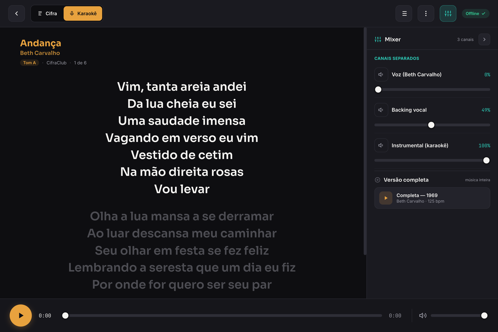

# Soma_play

[English](README.md) · **Português**

Um PWA offline e instalável para ler cifras, tocar junto com áudio multicanal e cantar
karaokê — feito para um tablet em cima da estante de partitura.

**[Abrir o app →](https://somacavalieri.github.io/somaplay/)** · Sem conta, sem servidor,
sem instalar nada. Tudo vive no seu aparelho.



---

## Por que ele existe

Cifra impressa não toca junto com você. E todo app de cifra que testei queria conta,
internet e assinatura — três coisas com que palco nenhum pode contar.

O que eu precisava era mais estreito e mais esquisito do que esses apps vendem:

- **No palco,** uma tela que continue legível com a luz mudando, que não apague sozinha e
  que nunca fique esperando uma requisição de rede.
- **No ensaio,** poder tirar o violão do mix e fazer aquela parte eu mesmo — ou tirar a
  voz e cantar.
- **Em casa,** uma cifra que role no meu ritmo, para as duas mãos continuarem no
  instrumento.

Essas três situações são as mesmas músicas vistas de três jeitos diferentes. Foi dessa
observação que nasceu a ideia central do app.

## Os três modos

O seletor de modo no topo é uma **lente sobre a biblioteca inteira** — a biblioteca se
filtra para o que existe no modo ativo.

| Modo | O que ele te dá |
|---|---|
| **T1 · Cifra** | A cifra, com rolagem automática de velocidade ajustável |
| **T2 · Acompanhamento** | Mixer multicanal — volume e mute por stem, transporte único |
| **T3 · Karaokê** | Base tocando, letra na tela |

Tocar uma música é **um toque só** — não existe seletor de modo no meio do caminho.
Dentro da música, o switch T1/T2/T3 funciona também como indicador: modo desabilitado
significa que aquela música não tem conteúdo para ele.

## Funcionalidades

**Cifras**
- Cifra por música em **imagem ou texto**, o que a fonte tornar mais prático
- **Toggle Aberta/Fechada** — mostra ou esconde os diagramas de acorde
- Rolagem automática com velocidade ajustável
- Miniaturas de diagrama inline, na linha dos acordes
- **Toque em qualquer acorde** do texto e abre um popover ancorado com o diagrama;
  *Variar* passeia pelas formas alternativas e *Aplicar* troca a digitação na música
  inteira
- **Editor de acordes** com pestana de verdade e um **dicionário de acordes** para
  navegar e guardar suas próprias variações

**Áudio**
- Um nó de ganho por stem, todos compartilhando um **relógio de transporte único** — por
  isso play/pause/seek globais ficam em sincronia
- Volume e mute por canal

**Biblioteca**
- Navegue por **Artista**, **Música**, **Estilo** ou **Lista**
- Setlists com reordenação por arrastar, mais favoritas
- Listas são globais — ignoram a lente de modo, e abrir uma música pela lista toca ela no
  melhor modo disponível

**Offline e dados**
- Service Worker para operação offline completa; instalável como PWA
- Arquivos grandes (áudio, imagens) em **OPFS**, metadados em **IndexedDB**
- **Backup** exporta e importa a biblioteca inteira — listas e favoritas incluídas — num
  único arquivo `.somaplay`, com **modo merge** que faz upsert por id em vez de apagar o
  que está no aparelho

## Traga o seu conteúdo

Este app é um **leitor**, não um acervo. Ele vem com uma única música de exemplo, escrita
para o projeto. Cifras, letras e áudio são **seus para adicionar**, e nunca saem do seu
aparelho — não existe servidor para onde mandar.

## Como rodar

Precisa de um servidor HTTP estático — `file://` não funciona, por causa do Service
Worker, do OPFS e dos ES modules.

```bash
git clone https://github.com/somacavalieri/somaplay.git
cd somaplay/app
python3 -m http.server 8137
# → http://localhost:8137
```

No Chrome (desktop ou tablet Android), use **menu → Instalar** para adicionar como app.
Depois da primeira visita, funciona sem internet nenhuma.

Para ver funcionando: **Configurações → Importar exemplos** carrega a música de
demonstração. Depois, **Configurações → Adicionar música** é onde entram as suas —
imagens de cifra ou texto colado, letra para karaokê e um arquivo de áudio por canal.

## Como funciona

Sem backend, sem build, sem dependências. ES modules servidos como estão.

| Aspecto | Abordagem |
|---|---|
| Áudio | Web Audio API — um nó de ganho por stem, relógio de transporte compartilhado |
| Offline | Service Worker faz precache do shell, cache-first |
| Arquivos grandes | OPFS (Origin Private File System) |
| Metadados | IndexedDB |
| Interface | JavaScript puro, ~4.000 linhas, zero dependências em runtime |

Testado em tablet Android (Chrome) como alvo principal, desktop como secundário.

## Contribuindo

Contribuições são bem-vindas. O setup é propositalmente pequeno: clone, sirva a pasta
`app/` e você está rodando a coisa real.

```bash
cd app
node --test        # suíte de testes — precisa de Node ≥ 20, não instala nada
node --check js/main.js
```

O projeto segue um fluxo **spec → plano → implementação**. As decisões de design ficam
escritas em `docs/superpowers/specs/` antes de o código ser tocado — esses documentos
estão em português e são o histórico honesto de como o app chegou até aqui.

Veja [CONTRIBUTING.md](CONTRIBUTING.md) para os detalhes.

## Roadmap

Acompanhado nas [issues](https://github.com/somacavalieri/somaplay/issues). Os itens
abertos maiores:

- **Interface em inglês** — hoje todas as strings de UI estão hardcoded em português;
  extrair para tradução é o próximo trabalho relevante
- Geração de diagramas a partir da cifra em texto
- Rolagem sincronizada ao áudio e letra de karaokê sincronizada no tempo
- Mudança de tom e de andamento
- Loop A-B

Deliberadamente **fora de escopo**: sincronização em nuvem, múltiplos usuários, separação
automática de stems e mixagem de microfone dentro do app.

## Status

Projeto pessoal em uso real — em casa, no ensaio e no palco — abrindo agora porque os
amigos pediram. Espere as arestas de um software escrito para um público de uma pessoa só.

## Licença

[MIT](LICENSE) — o código. O conteúdo que você carrega nele continua seu.
